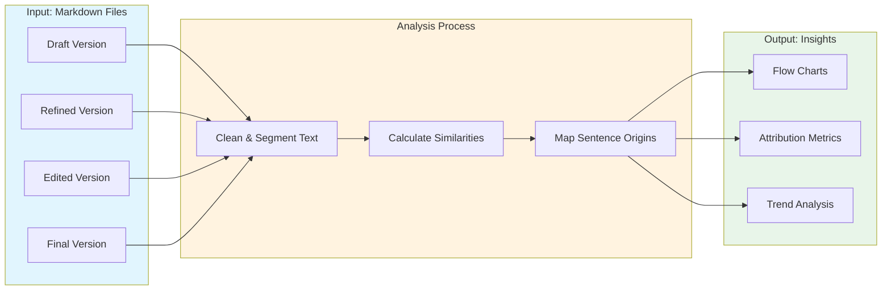

# Content Analysis System: AI vs Human Contribution Tracking

**A Jupyter notebook-based tool for tracking content evolution and analyzing AI vs human contributions across editorial workflows.**

---

## What You Need to Know

**Technical level**: This tool requires familiarity with:
- Google Colab or Jupyter notebooks
- Python basics (no coding required, but helpful)
- Markdown file formats
- Basic data analysis concepts

**What you'll need**:
- Google account (for Google Colab access)
- Content in markdown format
- Consistent file naming for different versions
- 15-30 minutes for initial setup and first analysis

**Don't worry if**: You're not a data scientist. The notebook guides you through each step with explanations and examples.

---

## Table of Contents

- [What This Tool Does](#what-this-tool-does)
- [How It Works](#how-it-works)
- [Common Use Cases](#common-use-cases)
- [Quick Start](#quick-start)
- [Performance Highlights](#performance-highlights)
- [Technical Architecture](#technical-architecture)
- [Setup and Requirements](#setup-and-requirements)
- [Usage Instructions](#usage-instructions)
- [Optimization Strategies](#optimization-strategies)
- [Troubleshooting](#troubleshooting)
- [Limitations](#limitations)

---

## What This Tool Does

The Content Analysis System helps you understand how content evolves through multiple editing stages by tracking:

**Key capabilities**:
- **Version tracking**: Monitor content progression (draft → refined → edited → final)
- **Similarity analysis**: Measure how much content changed between versions
- **Attribution mapping**: Identify which sentences came from AI vs human contributions
- **Interactive visualization**: Generate flow charts and trend dashboards
- **Confidence scoring**: Get percentage-based attribution with confidence levels

**Why use this**:
- Understand your editorial workflow efficiency
- Measure AI tool impact on content quality
- Track content transformation over time
- Generate data-driven insights for process improvement

---

## How It Works



**The workflow**:

1. **Data Ingestion**: Load your article versions (markdown files)
2. **Text Preprocessing**: Clean formatting and segment into sentences
3. **Similarity Analysis**: Calculate lexical and semantic similarities
4. **Attribution Mapping**: Trace each sentence back to its source
5. **Visualization**: Generate interactive charts and reports

---

## Common Use Cases

### Use Case 1: Editorial Process Analysis

**Scenario**: You want to understand how much human editors change AI-generated drafts.

**Workflow**:
1. Save AI draft as `draft-article-name.md`
2. Save human-refined version as `refined-article-name.md`
3. Save final edited version as `final-article-name.md`
4. Run the analysis notebook
5. Review attribution percentages and flow charts

**Insights you'll get**:
- Percentage of content from AI vs human at each stage
- Which sections changed most during editing
- Confidence scores for each attribution

---

### Use Case 2: Content Evolution Tracking

**Scenario**: You need to track how an article evolved through multiple review cycles.

**Workflow**:
1. Save versions with consistent naming (draft, refined, edited, final)
2. Load all versions into the notebook
3. Run complete analysis workflow
4. Generate trend visualizations

**Insights you'll get**:
- Version-to-version similarity scores
- Content retention across editing stages
- Visual progression through the editorial pipeline

---

### Use Case 3: Quality Gate Validation

**Scenario**: You want to ensure content changes meet quality standards.

**Workflow**:
1. Set similarity threshold (e.g., 95% retention required)
2. Analyze before/after versions
3. Check if changes exceed acceptable variance
4. Generate validation report

**Insights you'll get**:
- Pass/fail against quality gates
- Detailed change metrics
- Sentence-level attribution for review

---

## Quick Start

### Running in Google Colab (Recommended)

**Step 1: Open the notebook**
1. Go to [Google Colab](https://colab.research.google.com/)
2. Upload the analysis notebook
3. Or: Open directly from GitHub/Google Drive

**Step 2: Mount Google Drive**
```python
from google.colab import drive
drive.mount('/content/drive')
```

**Step 3: Prepare your content**
- Create a folder in Google Drive with your markdown files
- Name files consistently:
  - `draft-article-name.md`
  - `refined-article-name.md`
  - `edited-article-name.md`
  - `final-article-name.md`

**Step 4: Run the analysis**
```python
# Basic execution
article_versions, preprocessor = process_article_interactive()
combined_results = run_complete_analysis_from_existing(article_versions, preprocessor)
viz_outputs = viz_article(combined_results)
```

**Step 5: Review outputs**
- Interactive flow charts appear in the notebook
- Download charts as images if needed
- Review attribution metrics in the summary section

---

## Performance Highlights (v1.3)

**Optimizations for faster analysis**:

| Metric | Before | After | Improvement |
|--------|--------|-------|-------------|
| **Runtime** | ~1.5 hours | ~15 minutes | 6x faster |
| **Library loading** | Every run | Cached | Eliminated redundancy |
| **Memory usage** | High (figures retained) | Low (auto cleanup) | Significant reduction |
| **Re-analysis** | Full process | Quick mode | Near instant |

**What this means**:
- You can iterate faster on content analysis
- Less waiting for results
- More efficient memory usage
- Easy to re-run with different parameters

---

## Technical Architecture

### Workflow Stages

**1. Data Ingestion**
- Load article versions from files
- Validate version sequence and metadata
- Check for required naming conventions

**2. Text Preprocessing**
- Clean markdown formatting (remove headers, links)
- Segment into sentences and paragraphs
- Prepare text for similarity analysis

**3. Similarity Analysis**
- Calculate lexical similarities (TF-IDF based)
- Compute semantic embeddings (transformer models)
- Generate comprehensive similarity matrices

**4. Attribution Mapping**
- Trace sentence origins across versions
- Generate confidence-scored attributions
- Create detailed source tracking

**5. Visualization**
- Generate interactive flow charts
- Create version progression visualizations
- Build trend analysis dashboards

### Core Components

| Component | Purpose | Technology |
|-----------|---------|------------|
| **ArticleVersions** | File management | Python file I/O |
| **TextPreprocessor** | Text cleaning | Regex, markdown parsing |
| **SimilarityAnalyzer** | Similarity engine | scikit-learn, sentence-transformers |
| **AttributionMapper** | Source tracking | Custom algorithm |
| **VisualizationEngine** | Chart generation | Plotly, matplotlib |

---

## Setup and Requirements

### Dependencies

**Python 3.8+** required, with these libraries:
- `numpy` - Numerical computing
- `matplotlib` - Basic plotting
- `sentence_transformers` - Semantic similarity
- `scikit-learn` - Machine learning utilities
- `plotly` - Interactive visualizations

**Installation** (in Google Colab):
```python
!pip install sentence-transformers scikit-learn plotly
# Other libraries are pre-installed in Colab
```

### Input File Requirements

**File format**: Markdown (`.md` files)

**Naming convention** (strict):
- Draft version: `draft-{article-name}.md`
- Refined version: `refined-{article-name}.md`
- Edited version: `edited-{article-name}.md`
- Final version: `final-{article-name}.md`

**Content requirements**:
- Valid markdown formatting
- Consistent text structure across versions
- Minimum content length: ~100 words (for meaningful analysis)

**Example structure**:
```
/content/drive/MyDrive/articles/
├── draft-seo-strategy-guide.md
├── refined-seo-strategy-guide.md
├── edited-seo-strategy-guide.md
└── final-seo-strategy-guide.md
```

---

## Usage Instructions

### Basic Workflow

**Step 1: Load environment**
```python
# Mount Google Drive (if using Colab)
from google.colab import drive
drive.mount('/content/drive')

# Configure environment
import os
os.chdir('/content/drive/MyDrive/articles')
```

**Step 2: Process article versions**
```python
# Interactive mode (prompts for file paths)
article_versions, preprocessor = process_article_interactive()

# Or: Specify directly
article_versions = ArticleVersions(
    draft_path='draft-article.md',
    refined_path='refined-article.md',
    edited_path='edited-article.md',
    final_path='final-article.md'
)
preprocessor = TextPreprocessor()
```

**Step 3: Run analysis**
```python
# Complete analysis workflow
combined_results = run_complete_analysis_from_existing(
    article_versions,
    preprocessor
)
```

**Step 4: Generate visualizations**
```python
# Create all visualizations
viz_outputs = viz_article(combined_results)

# Access specific charts
flow_chart = viz_outputs['flow_chart']
trend_chart = viz_outputs['trends']
```

### Advanced Options

**Custom similarity thresholds**:
```python
# Set custom confidence threshold (default: 0.8)
combined_results = run_complete_analysis_from_existing(
    article_versions,
    preprocessor,
    similarity_threshold=0.9  # More strict
)
```

**Verbose mode for debugging**:
```python
# Enable detailed diagnostics
combined_results = run_complete_analysis_from_existing(
    article_versions,
    preprocessor,
    verbose=True
)
```

**Export results**:
```python
# Save results to JSON
import json
with open('analysis_results.json', 'w') as f:
    json.dump(combined_results, f, indent=2)
```

---

## Optimization Strategies

### For Faster Analysis

**1. Use quick re-analysis mode**
```python
# After first run, use this for faster iteration
combined_results = run_complete_analysis_from_existing(
    article_versions,
    preprocessor
)
# Instead of: run_complete_analysis() which reloads libraries
```

**2. Monitor memory consumption**
```python
# Check memory usage
import psutil
process = psutil.Process()
print(f"Memory usage: {process.memory_info().rss / 1024 / 1024:.2f} MB")
```

**3. Leverage checkpoint system**
```python
# For long analyses, save intermediate results
checkpoint = {
    'preprocessed': preprocessor.clean_texts,
    'similarities': similarity_matrices
}
# Resume from checkpoint later
```

**4. Batch processing**
```python
# Process multiple articles efficiently
articles = ['article1', 'article2', 'article3']
results = []

for article in articles:
    versions = load_article_versions(article)
    result = run_complete_analysis_from_existing(versions, preprocessor)
    results.append(result)
    # Clear memory between analyses
    plt.close('all')
```

---

## Troubleshooting

### File Not Found Errors

**Symptom**: `FileNotFoundError: draft-article.md`

**Solution**:
1. Verify file paths are correct
2. Check Google Drive mount is active: `!ls /content/drive/MyDrive/`
3. Ensure files use correct naming convention
4. Verify you're in the correct directory: `!pwd`

---

### Invalid Markdown Formatting

**Symptom**: Analysis produces unexpected results or errors

**Solution**:
1. Open markdown files and check for invalid syntax
2. Remove any special characters or formatting that breaks parsing
3. Ensure consistent structure across all versions
4. Use a markdown validator to check files

---

### Low Similarity Scores

**Symptom**: Attribution confidence scores are unexpectedly low

**Causes**:
- Major content rewrite between versions
- Very short content (< 100 words)
- Formatting differences affecting text extraction

**Solution**:
1. Review versions to understand actual changes
2. Lower similarity threshold if appropriate
3. Check preprocessor is cleaning text correctly
4. Use verbose mode to see detailed similarity scores

---

### Memory Errors

**Symptom**: `MemoryError` or notebook crashes

**Solution**:
1. Close and clear output from old cells
2. Restart runtime and re-run from beginning
3. Process fewer articles at once
4. Use `plt.close('all')` to clear figures after each analysis

---

### Library Loading Warnings

**Symptom**: Dependency validation messages appear

**Solution**:
- These are informational, not errors
- Library loading is validated automatically
- If a library is missing, install it: `!pip install library-name`
- Review validation messages to ensure all dependencies loaded

---

### Visualization Not Appearing

**Symptom**: Charts don't display in notebook

**Solution**:
```python
# Ensure Plotly is configured for notebook display
import plotly.io as pio
pio.renderers.default = 'colab'  # For Google Colab
# Or: pio.renderers.default = 'notebook'  # For Jupyter

# Re-generate visualization
viz_outputs = viz_article(combined_results)
```

---

## Limitations and Considerations

### Content Requirements

**Designed for**: Structured markdown content with clear versioning

**Not ideal for**:
- Non-markdown formats (HTML, PDF, Word)
- Content without clear version progression
- Very short documents (< 50 words)
- Highly technical content with specialized terminology

### Model Biases

**Semantic analysis**: Transformer models have language and domain-specific biases
- Trained primarily on English text
- May not capture domain-specific nuances
- Confidence scores are estimates, not absolute truth

**Recommendation**: Use attribution scores as guidance, not definitive proof

### Performance Considerations

**Factors affecting runtime**:
- Document length (longer = slower)
- Number of versions (more versions = more comparisons)
- Semantic model size (larger = more accurate but slower)
- Available system resources

**Typical performance**:
- Short article (500 words, 4 versions): ~5 minutes
- Medium article (2000 words, 4 versions): ~10-15 minutes
- Long article (5000+ words, 4 versions): ~20-30 minutes

---

## Integration with BMLA Framework

This tool supports the **Measure** phase of the Build → Measure → Learn → Adapt framework:

**Build**: Create content through editorial workflow
**Measure**: Use this tool to quantify evolution and attribution
**Learn**: Extract insights from attribution metrics
**Adapt**: Improve editorial process based on findings

### Quality Gates

**Recommended thresholds**:
- **Similarity threshold**: 80% for most content types
- **Attribution accuracy**: 95% validation requirement
- **Performance benchmark**: Runtime under 15 minutes

---

## Future Roadmap

**Planned enhancements**:
- Multi-language support (beyond English)
- More granular attribution confidence scoring
- Expanded visualization options (network graphs, heat maps)
- Improved trend analysis capabilities
- Automated quality gate validation
- Export to PDF/Word reports

---

## Version History

**v1.3** (Current) - Major performance optimizations
- Runtime reduction (90% faster)
- Improved caching for libraries
- Enhanced similarity methods
- Automatic memory management

**v1.2** - Enhanced visualization
- Interactive Plotly charts
- Trend analysis dashboards
- Improved attribution display

**v1.1** - Core functionality
- Basic similarity analysis
- Initial attribution mapping
- Static visualizations

**v1.0** - Initial release
- Version management
- Text preprocessing
- Basic analysis workflow

---

## Support and Contributing

**For questions**:
- Check this README first
- Review the notebook comments and docstrings
- Consult example outputs in the repository

**For bug reports**:
- Include Python version and library versions
- Provide sample input files (if possible)
- Share error messages and stack traces
- Describe expected vs actual behavior

**For contributions**:
- Follow existing code style and structure
- Add tests for new functionality
- Update documentation
- Submit pull request with clear description

---

## License

[Include specific licensing information]

---

**Last Updated**: 2025-10-03
**Current Version**: 1.3
**Status**: Active development

For the latest features and optimizations, always refer to the most recent version of this documentation.
